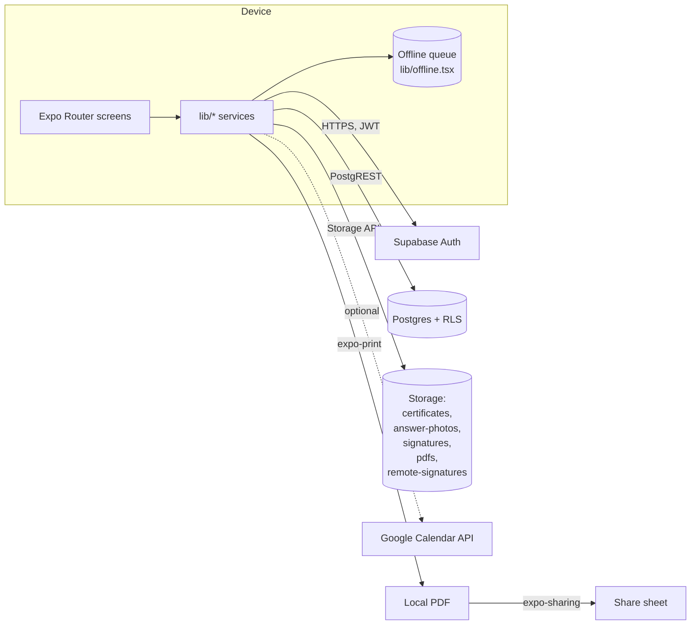

# Architecture

Sarke 2.0 is a **client-only** mobile app talking directly to **Supabase** — there is no custom HTTP backend. All reads and writes go through the Supabase JS SDK; PostgREST + RLS is the API.

## High-level data flow

## Layers

| Layer | Where | Responsibility |
| --- | --- | --- |
| **Routes** | `app/**` | File-based routing, screen rendering, calling services |
| **Components** | `components/**` | Reusable presentation; no Supabase calls |
| **Services** | `lib/services.ts` (+ `.real.ts` / `.mock.ts`) | CRUD against Supabase, the only Supabase consumers |
| **Domain types** | `types/models.ts` | TS mirror of the Postgres schema |
| **Cross-cutting** | `lib/session.tsx`, `lib/offline.tsx`, `lib/toast.tsx` | Auth context, offline queue, notifications |

The split between `services.real.ts` and `services.mock.ts` is selected at boot via `expo.extra.useMockData`.

## Auth

- Email + password via Supabase Auth (PKCE flow with `expo-auth-session`).
- Session is restored on cold-start in `lib/session.tsx`; a stale-refresh-token rejection during boot is swallowed and the user is treated as logged out (see commit `b8d3f0d`).
- T&C acceptance is gated in `_layout.tsx` — users without a `tc_accepted_version` are routed to `/terms`.

## Offline

- `lib/offline.tsx` exposes a queue of pending mutations; UI surfaces show `<SyncStatusPill />` and `<OfflineBanner />`.
- Photos are uploaded via `FileSystem.uploadAsync` to bypass a Hermes Blob bug (commit `feb13af`).
- Optimistic deletes are tracked in `lib/pendingDeletes.ts`.

## PDF generation

- Templates are hand-written HTML strings in `lib/pdf.ts` with inlined CSS.
- Photos and signatures are embedded as base64 data URIs (see commit `23f3e89` for the iOS / Hermes fix).
- The HTML is rendered via `expo-print` and shared via `expo-sharing`.

See [PDF generation](./pdf-generation.md) and [Signing flow](./signing-flow.md) for details.
