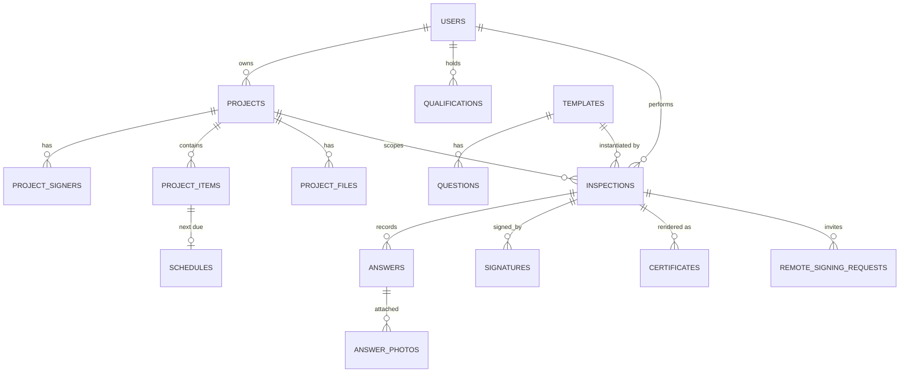

# Data Model

TypeScript mirror lives in [`types/models.ts`](https://github.com/gilavi/sarke2.0/blob/main/types/models.ts); SQL source of truth is `supabase/migrations/0001_init.sql` plus follow-up migrations.

## Entity-relationship diagram

## Entities

### AppUser

`users` row for the logged-in expert. Holds T&C acceptance state and an optional `saved_signature_url` for one-tap self-signing.

### Project

The site / job. Contains crew (denormalised JSON column, see migration `0013`), optional logo, lat/lng for `<MapPicker />`.

### ProjectFile

Supporting documents attached to a project (PDFs, images, scans).

### ProjectSigner

A pre-registered human tied to a project. Their `signature_png_url` is reused across inspections.

### CrewMember

Lightweight on-site participant (name + freeform role + optional signature). Stored as a JSON array on `projects.crew`. The logged-in inspector is **not** in this array — it's derived from auth and rendered as the first row.

### Template

Inspection form definition. References `Question[]`, declares `required_qualifications` (qualification types the operating expert must hold) and `required_signer_roles`.

### Question

A single form field within a template. `type` selects the input shape (yesno / measure / component_grid / freetext / photo_upload).

### Inspection

The on-site record. Captures `status`, `harness_name`, `conclusion_text`, `is_safe_for_use`. Once `status = 'completed'` it is **frozen** by DB triggers (migrations `0008`, `0010`).

### Answer / AnswerPhoto

Per-question response. Multiple typed value columns (`value_bool`, `value_num`, `value_text`, `grid_values` JSON). `AnswerPhoto` rows attach photos via Storage paths.

### ProjectItem

Tracked asset (a specific harness, scaffold section) under a project; the unit a `Schedule` recurs against.

### Schedule

Recurring inspection cadence for a project_item. Optional Google Calendar mirror via `google_event_id`.

### Qualification

The expert's professional credential — was previously called `Certificate`, renamed in migration `0006`.

### SignatureRecord

One row per `(inspection, signer_role)`. `status: 'signed' | 'not_present'` lets the inspection complete even when a required signer is unreachable.

### Certificate

Generated PDF derived from an inspection. `is_safe_for_use` and `conclusion_text` are **snapshotted** so old certificates don't drift.

### RemoteSigningRequest

Async signer invitation (token + SMS). Lifecycle: `pending → sent → signed | declined | expired`.

## Enums

| Enum | Values |
| --- | --- |
| **SignerRole** | `expert`, `xaracho_supervisor`, `xaracho_assembler` |
| **QuestionType** | `yesno`, `measure`, `component_grid`, `freetext`, `photo_upload` |
| **InspectionStatus** | `draft`, `completed` *(Postgres enum is still named `questionnaire_status` — see migration `0006` notes)* |
| **SignatureStatus** | `signed`, `not_present` |
| **RemoteSigningStatus** | `pending`, `sent`, `signed`, `declined`, `expired` |
