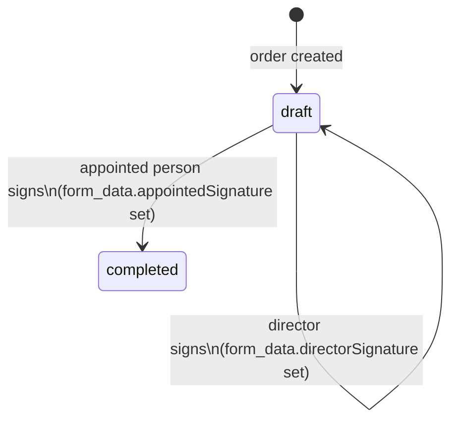

# Orders / ბრძანებები

Safety appointment orders. A legally formatted document appointing a responsible person for a specific safety domain at a site.

## Data model

Single `orders` table — migration `0038`. No per-type sub-tables; `document_type` is plain `text` with no CHECK constraint, and `form_data` is `jsonb`.

```sql
orders (
  id           uuid primary key,
  project_id   uuid references projects,
  user_id      uuid references auth.users,
  document_type text,          -- see types below
  form_data    jsonb,          -- all template-specific fields
  status       text check (status in ('draft', 'completed')),
  pdf_url      text,
  pdf_hash     text,           -- sha256 of the generated PDF
  created_at   timestamptz,
  updated_at   timestamptz
)
```

TypeScript types live in `types/models.ts` (mobile) and `web-app/src/lib/data/orders.ts` (web).

## Document types

### `labor_safety_specialist`
**შრომის უსაფრთხოების სპეციალისტის დანიშვნა**

Appoints a labour safety specialist. Key `form_data` fields: `specialistName`, `specialistPersonalId`, `certificateNumber`, `certificateDate`, `facilityName`.

No signing required — status goes to `completed` on save.

---

### `alcohol_control`
**ალკოჰოლური და ნარკოტიკული თრობის კონტროლი**

Appoints a responsible person for alcohol/drug control. Key `form_data` fields: `responsiblePersonName`, `responsiblePersonPosition`, `responsiblePersonPersonalId`, `facilityName`.

No signing required.

---

### `fire_safety_order`
**სახანძრო უსაფრთხოებაზე პასუხისმგებელი პირის დანიშვნა**

Appoints a fire safety responsible person. Key `form_data` fields: `appointedName`, `appointedPhone`, `objectName`, `objectAddress`.

**Signing required** — 2-signatory flow: director signs first, then the appointed person. Both signatures are embedded as base64 PNG in `form_data.directorSignature` / `appointedSignature` (not in the `signatures` table). Status becomes `completed` when both have signed.

PDF: 3-clause document with 3 legal basis bullets.

---

### `fire_safety_order_enterprise`
**საწარმოს სახანძრო უსაფრთხოებაზე პასუხისმგებელი პირის დანიშვნა**

Enterprise variant of the fire safety order for construction site workplaces. Additional `form_data` fields: `appointedPosition`, `appointedIdNumber`.

**Signing required** — same 2-signatory flow.

PDF: 5-clause document, 4 legal basis bullets (adds №477 construction-site decree). Extended clause 2 covers structural checks, evacuation plan, №457 compliance, Permit to Work, briefing journal, annual drills, compressed gas handling, and 112 notification obligations.

---

## Signing flow (fire safety variants)



1. Director taps "ხელმოწერა" → `SignatureCanvas` → base64 PNG saved to `form_data.directorSignature`
2. Appointed person button is disabled until director has signed
3. Appointed person signs → status set to `completed`
4. Either signature can be reset (button resets to null + clears `SignedAt`)

Signatures are **not** stored in the generic `signatures` table — they live directly in `form_data` to keep the order self-contained.

## Mobile screens

| Screen | Path | Purpose |
|---|---|---|
| Order wizard | `app/orders/new.tsx` | 4–6 step wizard (steps vary by type) |
| Order success | `app/orders/[id].tsx` | Success screen after creation |

The wizard step count: 4 steps for labor/alcohol types, 6 steps for both fire safety variants (adds director signing step + appointed signing step).

## Web dashboard

| Route | Component | Purpose |
|---|---|---|
| `/orders/new` | `NewOrder.tsx` | Document type picker + multi-step form |
| `/orders/:id` | `OrderDetail.tsx` | View order, collect signatures, view PDF |

`OrderDetail.tsx` shows the info table, signature pads (fire safety only), and the delete button. The PDF preview button opens the generated HTML in a new tab.

## PDF generation

**Mobile:** `lib/orderPdf.ts` — one builder function per document type:
- `buildLaborSafetyOrderHtml(f)`
- `buildAlcoholControlOrderHtml(f)`
- `buildFireSafetyOrderHtml(f)`
- `buildFireSafetyOrderEnterpriseHtml(f)`

**Web:** `web-app/src/lib/orderPdf.ts` — same builders, `openOrderPdfPreview(html)` opens in new tab.

Shared CSS (`BASE_CSS`) is defined once and reused across all builders in each file.

## Adding a new document type

1. Add to `OrderDocumentType` union in `types/models.ts` and `web-app/src/lib/data/orders.ts`
2. Add a `FormData` interface for the new type
3. Add its label to `ORDER_DOCUMENT_TYPE_LABEL` in both files
4. Write a `buildXHtml()` function in both `lib/orderPdf.ts` and `web-app/src/lib/orderPdf.ts`
5. Add the doc type option + form step + `buildFormData()` case to both `app/orders/new.tsx` and `web-app/src/pages/NewOrder.tsx`
6. Update `web-app/src/pages/OrderDetail.tsx` info rows for new fields
7. No migration needed — `document_type` is `text`, `form_data` is `jsonb`
