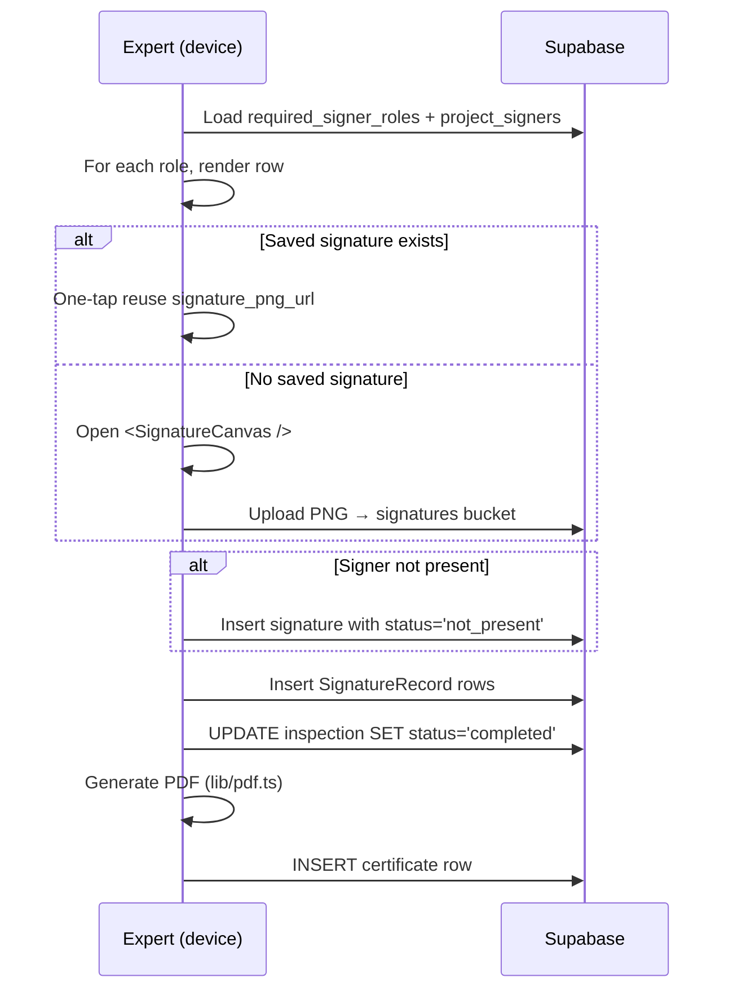

# Signing Flow

The end of an inspection collects signatures from a set of roles defined on the template (`required_signer_roles`). There are two delivery modes: **on-site** and **remote**.

## On-site (default)

Saved signatures: a `ProjectSigner.signature_png_url` lets the same human sign multiple inspections without redrawing each time. The expert's own signature can be saved on `users.saved_signature_url`.

The `not_present` status (introduced in migration `0004`) lets an inspection complete even when a required signer can't be reached, with the absence recorded.

## Remote signing

When a signer is offline (literally or logistically), the expert can invite them via SMS. Lifecycle:

| Status | Meaning |
| --- | --- |
| `pending` | Row inserted, SMS not yet sent |
| `sent` | SMS dispatched (link contains `token`) |
| `signed` | Signer completed signing in the linked web view |
| `declined` | Signer rejected with optional `declined_reason` |
| `expired` | `expires_at` passed without a final state |

Expired requests block inspection completion until the expert either re-sends, marks the signer not_present, or replaces them.

Surfaces:

- [`<AddRemoteSignerModal />`](./components.md#addremotesignermodal) — opens the form
- [`lib/sms.ts`](./lib.md#smsts) — sends the invitation
- [`lib/services.real.ts`](./lib.md#data-services) → `remoteSigningApi`
- The signer-side web flow (signing UI) is **not** in this repo; it consumes `remote_signing_requests` via the same Supabase project.
